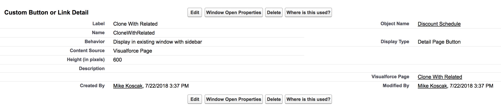

# CloneDiscountScheduleTiers
Clone button for a Discount Schedule record that also clones related Discount Tiers in Salesforce CPQ

## Setup

### Create Clone Button

1. Navigate to Setup
2. Search in Quick Find for **Objects** to navigate to list of custom objects
3. Navigate to the **Discount Schedule** object
4. Under Buttons, Links and Actions select **New Button or Link**
5. Create a button with the following setup:

6. Add the button to the Discount Schedule page layout